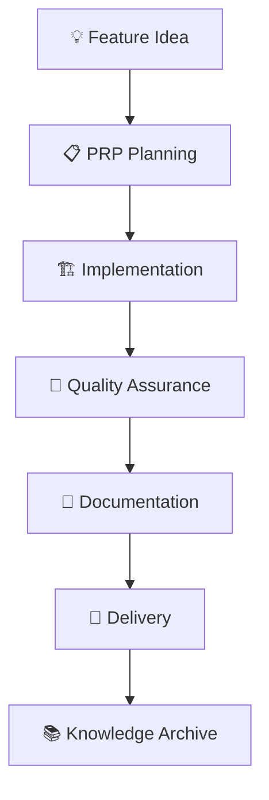

# 🚀 Complete Archon Workflow: Start to Finish

This is the comprehensive guide for the complete Archon PRP/R-D workflow from initial idea to final delivery.

## 🎯 Workflow Overview



## Phase 1: 💡 Feature Ideation & Planning

### 1.1 Generate Feature Idea
- Identify business need or technical requirement
- Define the problem you're solving
- Consider BMAD classification (Business/Model/Automation/Delivery)

### 1.2 BMAD Classification
Classify your feature into one or more facets:
- **Business (B)**: User requirements, business logic, workflows
- **Model (M)**: Data structures, APIs, system architecture
- **Automation (A)**: Scripts, tools, CI/CD, development processes
- **Delivery (D)**: UI/UX, deployment, monitoring, user experience

## Phase 2: 📋 PRP Creation & Specification

### 2.1 Quick Start with Automation
```bash
# All-in-one feature setup
scripts/start_feature.sh {feature-name} "{BMAD-facet}" "{description}"
```

### 2.2 Manual PRP Creation
```bash
# Create the feature structure
mkdir -p ai_docs/PRPs/feature-{name}/001
mkdir -p artifacts/feature-{name}/001

# Create PRP.md using the standard template
# Include: Goal, Inputs, Constraints, Context Bits, Runbook, Acceptance
```

## Phase 3: 🏗️ Implementation

### 3.1 Follow PRP Runbook
- Implement exactly what's specified in the PRP
- Create files in the order specified
- Follow naming conventions and constraints
- Make minimal, focused changes

### 3.2 Incremental Development Pattern
```bash
# For each step in the runbook:
# 1. Implement the step
{edit/create files as specified}

# 2. Test the step
{run relevant tests/validation}

# 3. Document progress
echo "Step X completed" >> artifacts/feature-{name}/001/notes.md

# 4. Commit frequently
git add {changed files}
git commit -m "feat({feature}): implement step X - {brief description}"
```

## Phase 4: 🧪 Quality Assurance

### 4.1 Run Comprehensive QA
```bash
# Run the full QA suite
make qa STORY=feature-{name}/001

# Check QA results
cat artifacts/feature-{name}/001/QA.md
```

### 4.2 Implementation Audit
```bash
# Run implementation audit
scripts/archon_impl_audit.sh feature-{name}/001

# Review audit results
cat artifacts/feature-{name}/001/audit_report.md
```

## Phase 5: 🚀 Delivery & Integration

### 5.1 Final Validation
```bash
# Run all guardrails
make verify-prp

# Final QA check
make qa STORY=feature-{name}/001
```

### 5.2 Commit with PRP Reference
```bash
# Stage all changes
git add -A

# Commit with proper PRP reference
git commit -m "feat: {feature description} (PRP feature-{name}/001)

{Detailed description of what was implemented}

BMAD Facet: {Primary facet}
Closes PRP feature-{name}/001"
```

## Phase 6: 📚 Knowledge Management

### 6.1 Publish to Obsidian
```bash
# Publish completed story to knowledge base
OBSIDIAN_VAULT="$HOME/Documents/ArchonVault" make publish STORY=feature-{name}/001
```

### 6.2 Daily Workflow Commands
```bash
# Morning setup
scripts/daily_workflow.sh start

# During development
scripts/daily_workflow.sh check {current-story}

# End of day
scripts/daily_workflow.sh end {current-story}
```

## 📋 Success Criteria

A successful Archon workflow implementation includes:
- ✅ Clear, implementable PRPs
- ✅ Quality code following standards
- ✅ Comprehensive testing and validation
- ✅ Complete documentation and artifacts
- ✅ Knowledge captured in Obsidian
- ✅ Continuous improvement mindset

This process ensures consistent, high-quality delivery while building a comprehensive knowledge base for future development.